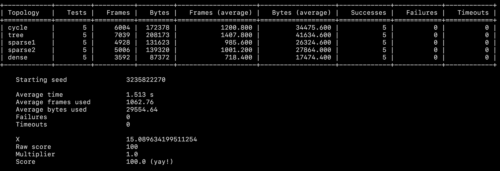

# cs-145-scripts

Scripts for testing CS 145 2324B Programming Tasks. 

## PT 3 usage instructions

First things first: you need at least **Python 3.12** to run this.

1) Download the files inside the `test3` folder and place them in your `task3attachments` folder.
2) Install the Python `tabular` package by running `pip install -r requirements.txt` or `pip install tabular`.
3) Make sure you're currently inside the `task3attachments` folder. To test your solution, run `python3 test3.py`. The output will look like this:

In particular:

- You'll see a **table** consisting of the results for each kind of topology. This will allow you to easily see which topolog(y/ies) you need to improve/fix your solution on.
- You'll see a list of **overall statistics**, just like with the testers for previous PTs.

You can customize the starting seed via the `-s` flag, as always. Unlike previous PTs, however, there are **two** ways of configuring how many tests you want to run this time:

- If you want to run the same number of tests $`t`$ for each topology, pass that number to the `-n` flag. This will run a total of $`5t`$ tests.
- If you want to specify a specific number of tests for each topology, pass **five nonnegative integers** to the `-d` flag. If the numbers you passed are $`t_1, t_2, \dots, t_5`$, this will run a total of $`t_1 + t_2 + t_3 + t_4 + t_5`$ tests.

By default, the tester will run five tests for each topology, like how our solutions will actually be tested.

You may only specify **at most one way** to customize the number of test cases; using both the `-n` and `-d` flags won't work.

As mentioned in the specs, the statistics (frame/byte counts) for a particular topology only count iff all tests under that topology pass, and your score will be multiplied by the fraction of topologies you handle correctly (shown in the output's `Multiplier` field).

Good luck! We can make it through this sem! `^_^`

<h2>PT 0-2 usage instructions (archived)</h2>

**IMPORTANT: test2.py requires Python 3.12.2 to run.**

### What is it

Runs tests on your `taskN.py`. Measures time-outs and output errors, and displays problematic test cases. Calculates your solution's performance. Total bits, average bits per message, x-value (formula given in each PT doc), and your score over 100.

The **number of tests** ran and **random seed** for each test program may be customized. Defaults are 100 tests and a random seed of `0xC0DEBABE`.

### How to use
1. For PT number `n` (`n = 0, 1`), download `test[n].py` and place in your `task[n]attachments` folder.
   - For PT2, download `test2.py` and `judgetool.pyc` and place in your `task2attachments` folder.
3. **Important:** In your terminal, navigate to `task[n]attachments/` and run `python3 test[n].py -h` to see the available options for running the script.
   - To check if your PT2 solution is valid, run a single test via `python test2.py -n 1`. Running the full 50 tests can take a while, and is recommended only for checking your score.

   
## Extra
Contributions are welcome! Raise an issue or a PR and I'll get to it ASAP.

## Contributors
jproads, daryll-ko, Ulyzses

*Released with permission from Sir Kevin and Sir Jem.*
